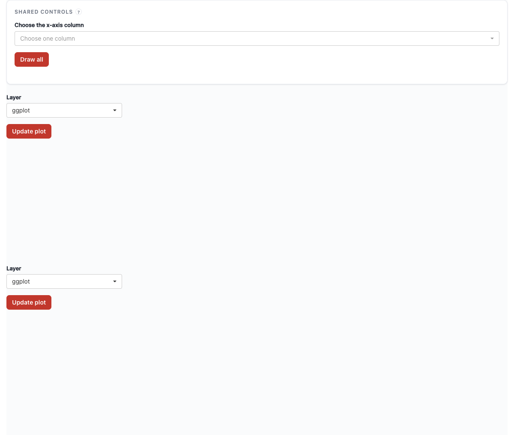

# Custom Rendering {#sec-custom-render}

"I want my own renderer." `ptr_server()` **returns** the app's state, so you can swap ggpaintr's plot pane for plotly, ggiraph, or any custom host. The runtime stays inside ggpaintr; you replace only the *output*. This is a UI-side swap — you place your own output widget — not a separate server pattern.

## The canonical pattern

Place your output widget at `shiny::NS(id)(...)` in the UI next to `ptr_ui_controls(formula, id)`, call the single `ptr_server(formula, id)` in your plain `server` function (it namespaces internally — you do **not** write a `moduleServer`), and bind your widget off the returned state:

```r
# UI:     plotly::plotlyOutput(shiny::NS("plot1")("my_plot"))
#         + ptr_ui_controls(formula, "plot1")
# server: state <- ptr_server(formula, "plot1")
#         output[[shiny::NS("plot1")("my_plot")]] <-
#           plotly::renderPlotly(state$runtime()$plot)
```

Because `ptr_server()` returns to your **top-level** server, Shiny does not auto-namespace your `output` assignment — wrap the id with `shiny::NS(id)()`, the same expression you used on the UI side. (Single embedding: omit the `id` and the `NS()` wrapper.)

## Two reading paths off the state

| Inside `renderX({...})` / `reactive({...})` / `observeEvent({...})` | Outside reactive contexts (download handlers, snapshots) |
|---|---|
| Read `state$runtime()` and unpack its slots (`$ok`, `$plot`, `$code_text`, `$error`). This takes the reactive dependency that wires re-renders to **Update plot** clicks. | Call `ptr_extract_plot(state)` / `ptr_extract_code(state)` / `ptr_extract_error(state)`. These wrap `shiny::isolate()` — current value, no reactive dependency. |

Mixing them — `ptr_extract_plot(state)` inside `renderPlotly({...})` — silently breaks reactivity: the block fires once on mount and never again. Stick to `state$runtime()` inside reactive blocks.

## Custom plot renderer

Render `ptr_ui_controls()` for the widgets, place your own output container, and never place `ptr_ui_plot()` — with no UI slot bound to it, the built-in plot output stays inert, so there is no bundled pane at all:

```{r}
#| eval: false
#| fixture: custom-render-plotly
formula <- "ggplot(iris, aes(x = ppVar, y = ppVar, color = ppVar)) + geom_point()"

ui <- ptr_ui_page(
  shiny::fluidRow(
    shiny::column(5, ptr_ui_controls(formula, "plot1")),      # widgets only
    shiny::column(
      7,
      plotly::plotlyOutput(shiny::NS("plot1")("custom_plot"), # your own output
                           height = "500px") |>
        ptr_ui_toggle_code(ptr_ui_code("plot1"))
    )
  )
)

server <- function(input, output, session) {
  state <- ptr_server(formula, "plot1")
  output[[shiny::NS("plot1")("custom_plot")]] <- plotly::renderPlotly({
    res <- state$runtime()
    shiny::req(isTRUE(res$ok), res$plot)
    plotly::ggplotly(res$plot)
  })
}

shiny::shinyApp(ui, server)
```


`req(isTRUE(res$ok), res$plot)` keeps the panel quiet between draws and on transient error states. The gallery's plotly and ggiraph originals (@sec-gallery § "Interactive output packages") are the graphics this pattern brings to life.

If you would rather keep ggpaintr's chrome *and* add a second custom view, capture the module's state and render a second output off it — `ptr_ui(formula, "p")` in the UI plus `state <- ptr_server(formula, "p")` in the server — but `ptr_ui()` always renders the bundled plot pane alongside your custom one. Use the bare-piece composition above when you want exactly one (custom) plot.

## Custom code panel

Bind to `state$runtime()` inside `renderText({...})` and pull `code_text` off it — in the same `server` function, after `state <- ptr_server(formula, "plot1")`:

```r
output[[shiny::NS("plot1")("my_code")]] <- shiny::renderText({
  state$runtime()$code_text %||% ""
})
```

For non-reactive contexts (a download handler, a snapshot test), the public accessor is `ptr_extract_code(state)`. It returns a single string and includes any `ptr_gg_extra()` expressions captured on the state.

## Custom error UI

`state$runtime()$error` is the latest runtime error string, or `NULL` when the last cycle succeeded:

```r
output[[shiny::NS("plot1")("my_status")]] <- shiny::renderUI({
  msg <- state$runtime()$error
  if (is.null(msg)) shiny::tags$div(class = "status-ok", "Plot is up to date")
  else              shiny::tags$div(class = "status-error", msg)
})
```

`ptr_extract_error(state)` is the non-reactive counterpart.

## Programmatic layer injection — `ptr_gg_extra()`

`ptr_gg_extra(state, ...)` evaluates one or more ggplot2 expressions and attaches the results as "extras" on the state. The runtime folds them into the rendered plot on the next cycle, and the generated code (both `state$runtime()$code_text` and `ptr_extract_code(state)`) includes them. Each call replaces the previously captured extras — pass everything you want layered on in a single call:

```{r}
#| eval: false
#| fixture: custom-render-extra
formula <- "ggplot(mtcars, aes(x = mpg, y = hp)) + geom_point()"

ui <- shiny::fluidPage(
  shiny::actionButton("add_log", "Toggle log-scale"),
  ptr_ui(formula)
)

server <- function(input, output, session) {
  state <- ptr_server(formula)
  shiny::observeEvent(input$add_log, {
    ptr_gg_extra(state, ggplot2::scale_x_log10())
  })
}

shiny::shinyApp(ui, server)
```


Eval errors from the captured expressions leave the existing extras untouched (atomic update), and extras are suppressed automatically while the underlying runtime reports a failure — stale extras from a prior successful draw never surface during an error state.

## Shared widgets driving custom renderers

The multi-instance coordinator (@sec-shared-placeholders) composes with custom outputs: one `ptr_shared_server(obj)` bundle feeds every per-plot `ptr_server()`, and each returned state feeds its own `renderPlotly()`. The cross-formula key lives in the bare `ptr_ui_shared_panel(obj)`; its keys are excluded from each `ptr_ui_controls(formula, id, shared = obj)`:

```{r}
#| eval: false
#| fixture: custom-render-shared
plots <- list(
  "ggplot(iris, aes(x = ppVar(shared = 'metric'), y = Sepal.Length, fill = Species)) + geom_boxplot()",
  "ggplot(iris, aes(x = ppVar(shared = 'metric'), y = Sepal.Width,  fill = Species)) + geom_violin()"
)

obj <- ptr_shared(formulas = plots)

ui <- ptr_ui_page(
  ptr_ui_shared_panel(obj),                                  # cross-formula panel (bare, L3)
  shiny::fluidRow(
    shiny::column(3, ptr_ui_controls(plots[[1]], "plot_1", shared = obj)),
    shiny::column(9, plotly::plotlyOutput(shiny::NS("plot_1")("custom")))
  ),
  shiny::fluidRow(
    shiny::column(3, ptr_ui_controls(plots[[2]], "plot_2", shared = obj)),
    shiny::column(9, plotly::plotlyOutput(shiny::NS("plot_2")("custom")))
  )
)
server <- function(input, output, session) {
  sh <- ptr_shared_server(obj)                               # top level, once
  state1 <- ptr_server(plots[[1]], "plot_1", shared_state = sh)
  state2 <- ptr_server(plots[[2]], "plot_2", shared_state = sh)
  output[[shiny::NS("plot_1")("custom")]] <- plotly::renderPlotly({
    res <- state1$runtime(); shiny::req(isTRUE(res$ok), res$plot)
    plotly::ggplotly(res$plot)
  })
  output[[shiny::NS("plot_2")("custom")]] <- plotly::renderPlotly({
    res <- state2$runtime(); shiny::req(isTRUE(res$ok), res$plot)
    plotly::ggplotly(res$plot)
  })
}

shiny::shinyApp(ui, server)
```



Because each `ptr_server()` call is at the top level, writing `output$custom` would bind to the bare id `"custom"`, not the namespaced `"plot_1-custom"` the UI expects — use `output[[shiny::NS(id)(name)]]`, the same id expression as on the UI side.
