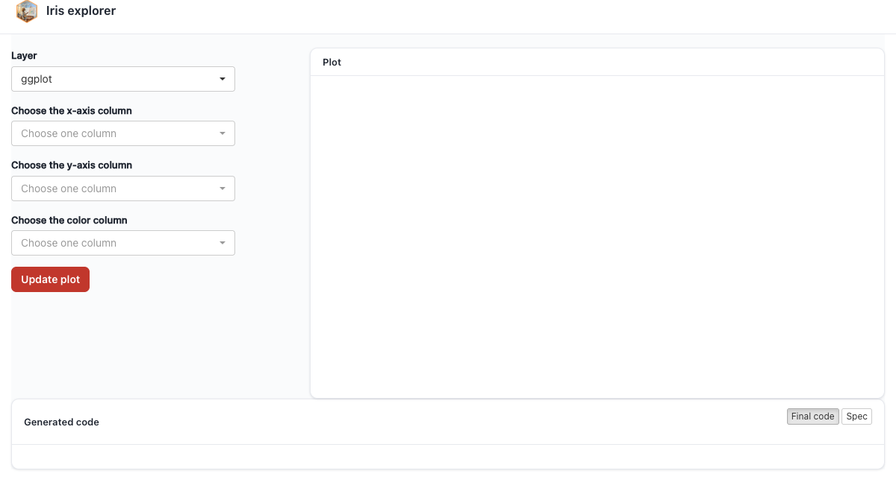

# Embedding with Bare Pieces {#sec-embed-bare}

L3 is the level finer than L2: instead of one self-contained default-layout block, **every piece of ggpaintr's UI has its own bare exported function** — emitting only its widgets, no wrapper, no assets — so you can pick exactly the pieces you want and place each one anywhere in your own Shiny. **L3 is a UI-side split only.** The server side does not change: you still call the single `ptr_server(formula, id)` exactly as at L2. The pieces write to and read from the same canonical ids it already targets, so a piece you never place is simply a no-op.

## The bare pieces and combinators

The pieces are deliberately orthogonal — an `id` (and, where relevant, a `formula`) plus at most a few cosmetic arguments such as `style =`, `page =`, or `css =`. There are no `error=` / `code_toggle=` flags on `ptr_ui_plot()`; layered behaviour is added by **combinators** that wrap already-built pieces:

| Function | What it emits |
|---|---|
| `ptr_ui_page(..., page, css)` | The optional page shell: a Bootstrap-3 page + the single `.ptr-app` theme scope + the deduped asset bundle, wrapping the pieces you pass |
| `ptr_ui_header(title)` | The branded header bar |
| `ptr_ui_controls(formula, id = NULL, ...)` | The generated control widgets (layer picker, per-layer panels, **Update plot**, inline shared section) |
| `ptr_ui_plot(id)` | The bare plot card — no error slot, no toggle |
| `ptr_ui_error(id)` | The bare inline error slot |
| `ptr_ui_code(id, style)` | The bare generated-code pane; `style = "panel"` (plain, always visible — default) or `"window"` |
| `ptr_ui_inline_error(plot, error)` | **Combinator**: nests an error piece inside a plot piece's card body |
| `ptr_ui_toggle_code(plotish, code)` | **Combinator**: wraps a plot-ish piece + code piece into the `</>` slide-out layout |
| `ptr_ui_shared_panel(obj)` | The bare cross-formula shared panel (L3 counterpart of `ptr_shared_panel()`) |
| `ptr_ui_assets(css)` | The CSS/JS bundle — **escape hatch only**, for roots `ptr_ui_page()` can't cover |

Two facts shape how the pieces behave:

1. **`ptr_ui_page()` is the only scaffolding to remember — and it is optional.** The controls need Bootstrap's CSS/JS, which Shiny loads only when the outermost UI object is a Bootstrap page builder; and the bundled theme is scoped under a single `.ptr-app`. `ptr_ui_page()` resolves both at once: it *is* the Bootstrap page and owns the theme scope plus the deduped assets. Write your own bare Shiny root instead and you own that scaffolding — the `navbarPage` recipe below shows exactly what to reproduce.
2. **Combinators add behaviour; flags do not.** A standalone `ptr_ui_code()` is a plain, always-visible panel needing no wiring. The inline error and the draggable slide-out code window come from composing pieces through the two combinators — pure DOM-structure helpers with no server coupling.

Ids must line up: pass the same `id` to every piece and to `ptr_server(formula, id)`. A single embedding needs no `id` at all; you never write your own `shiny::moduleServer()`. Hand-placing pieces makes id collisions most likely, so keep the whole `ptr_`-prefixed top-level id set reserved — the full list lives in @sec-shared-placeholders § "How input ids are built".

## A fully hand-laid-out page

Header, controls, plot, error, and code each in their own region:

```{r}
#| eval: false
#| fixture: embed-bare-pieces
formula <- "ggplot(iris, aes(x = ppVar, y = ppVar, color = ppVar)) + geom_point()"

ui <- ptr_ui_page(                          # Bootstrap page + single .ptr-app + assets
  ptr_ui_header("Iris explorer"),
  shiny::fluidRow(
    shiny::column(4, ptr_ui_controls(formula = formula)),
    shiny::column(8, ptr_ui_plot())         # bare plot card; error placed below
  ),
  ptr_ui_error(),                           # error banner in its own row
  ptr_ui_code()                             # plain, always-visible code card
)
server <- function(input, output, session) {
  ptr_server(formula)   # binds ptr_plot / ptr_error / ptr_code
}

shiny::shinyApp(ui, server)
```



Swap the page builder with `page =` for a different Bootstrap-3 root — `ptr_ui_page(..., page = shiny::fillPage)` for edge-to-edge, for instance. The contract is any BS3 page builder whose `...` are tag children: `fluidPage` (default), `fixedPage`, `fillPage`, `bootstrapPage`, `basicPage`. It is **not** `navbarPage` (which takes a positional `title` plus `tabPanel()` children) and **not** a bslib/BS5 page (the bundled CSS is Bootstrap-3-scoped). For those roots, decompose by hand (below).

All three panes — plot, error, code — are empty until the first **Update plot** click, exactly as in the bundled app. And `ptr_ui_code()` already renders its own bordered card with a "Generated code" header — drop it straight into the layout; don't bury it in a collapsed `tags$details()`, or only the disclosure summary shows.

## The familiar slide-out code window

Want the `</>` slide-out and inline error while owning the surrounding layout? Compose with the two combinators — this nested call is byte-for-byte the output block `ptr_ui()` renders internally. `ptr_app()` wires the same behaviour but builds its slide-out window slightly differently (its code-mode toggle sits in the window head), so only cosmetics differ from that path:

```{r}
#| eval: false
#| fixture: embed-bare-toggle
formula <- "ggplot(iris, aes(x = ppVar, y = ppVar, color = ppVar)) + geom_point()"

ui <- ptr_ui_page(
  ptr_ui_header("Iris explorer"),
  shiny::sidebarLayout(
    shiny::sidebarPanel(ptr_ui_controls(formula = formula)),
    shiny::mainPanel(
      ptr_ui_toggle_code(                                   # </> slide-out toggle ...
        ptr_ui_inline_error(ptr_ui_plot(), ptr_ui_error()), # ... around plot + inline error
        ptr_ui_code()                                       # ... wrapped as the slide-out window
      )
    )
  )
)
server <- function(input, output, session) {
  ptr_server(formula)
}

shiny::shinyApp(ui, server)
```


## Custom or `navbarPage` roots — decompose by hand

For the roots `ptr_ui_page()` deliberately does not cover, hand-build what it expands to — a Bootstrap page, `ptr_ui_assets()` once (its **only** sanctioned use), and one `div(class = "ptr-app")` around the pieces:

```{r}
#| eval: false
#| fixture: embed-navbar
formula <- "ggplot(iris, aes(x = ppVar, y = ppVar, color = ppVar)) + geom_point()"

ui <- shiny::navbarPage(
  "Iris explorer",                            # navbarPage needs a positional title
  shiny::tabPanel(
    "Plot",
    ptr_ui_assets(),                          # the bundle, once (self-deduping) — escape hatch
    shiny::tags$div(
      class = "ptr-app",                      # the single theme scope
      shiny::sidebarLayout(
        shiny::sidebarPanel(ptr_ui_controls(formula = formula)),
        shiny::mainPanel(
          ptr_ui_toggle_code(
            ptr_ui_inline_error(ptr_ui_plot(), ptr_ui_error()),
            ptr_ui_code()
          )
        )
      )
    )
  ),
  shiny::tabPanel("About", "Built with ggpaintr.")
)
server <- function(input, output, session) {
  ptr_server(formula)
}

shiny::shinyApp(ui, server)
```


This is exactly the body of `ptr_ui_page()` — `page(ptr_ui_assets(css), div(class = "ptr-app", ...))` — inlined into the one tab, so it doubles as a transparent view of what the shell does for you. Keep `ptr_ui_assets()` and the `.ptr-app` wrapper *inside* each tab that hosts ggpaintr pieces; the bundle is self-deduping, so repeating it costs nothing.

## Placing individual placeholder widgets

`ptr_ui_controls()` is the whole controls panel and is the supported way to render the generated widgets. ggpaintr does not expose a public accessor for the parsed node tree, so hand-placing *individual* placeholder widgets is not a supported workflow. To add custom widget *types*, register them instead — @sec-custom-placeholders.

## Swapping a pane for your own renderer

Never place `ptr_ui_plot()` and put a `plotly::plotlyOutput()` there instead — that is the custom-renderer pattern, and it gets its own chapter: @sec-custom-render.
