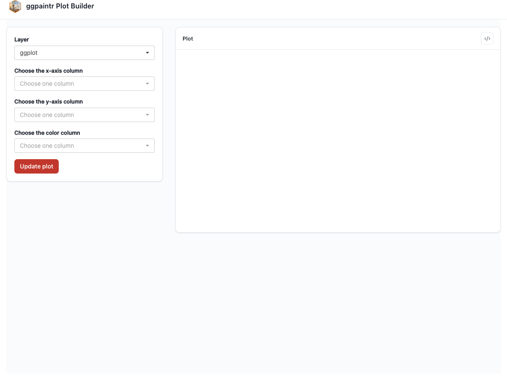

# The Formula Language {#sec-formula-language}

The **formula** is the single source of truth for a ggpaintr app: what gets plotted, which decisions the user gets to make, and — as this chapter shows — which layers and pipeline stages are part of the chart on first paint. `ptr_app()` accepts the formula in two equivalent forms: as bare code (`ptr_app(ggplot(...) + ...)`) or as a string (`ptr_app("ggplot(...) + ...")`). The string form is convenient when the formula is built up programmatically or stored in a file; everything in this chapter works in both.

## The tour formula

One string exercising four of the five built-in placeholders:

```{r}
#| eval: false
#| fixture: formula-tour
ptr_app("
ggplot(iris, aes(x = ppVar, y = ppVar, color = ppVar)) +
geom_point(size = ppNum) +
labs(title = ppText) +
facet_wrap(ppExpr)
")
```



The full grammar reference — positional-argument seeding, the `shared = "<id>"` annotation (@sec-shared-placeholders), and the empty-call cleanup rule (@sec-generated-code) — lives at `?ptr_app`.

## Data pipelines in the formula

A layer's data argument is allowed to be a pipeline. Both `|>` and `%>%` are accepted, and the two can be mixed in the same chain. Each pipeline stage that contains a placeholder gets its own row of widgets under the layer's **Data** subtab, plus a per-stage enable/disable toggle that rewrites the generated code as if that step were never there. Column pickers downstream of a stage lazily re-resolve their column choices against the current Data-subtab inputs, so changing a filter threshold immediately refreshes the picker below it.

```{r}
#| eval: false
#| fixture: formula-pipeline
ptr_app(
"mpg |>
dplyr::filter(displ > ppNum) |>
dplyr::group_by(class) |>
dplyr::filter(dplyr::n() > ppNum) |>
dplyr::ungroup() |>
ggplot(aes(ppVar, ppVar, color = class)) +
geom_point(alpha = ppNum)"
)
```


@sec-gallery § "Data-cleaning pipelines" shows this same example next to the plain dplyr pipeline it parameterizes.

### What is supported

- **Both pipe operators**, possibly mixed in the same chain: `df %>% filter(...) |> ggplot(...)`.
- **Bare-symbol stage heads**: `filter(...)`, `head(...)`, `transform(...)`.
- **Namespaced stage heads**: `dplyr::filter(...)`, `tidyr::pivot_longer(...)`.
- **Parenthesised heads**: `(filter)(...)`.
- **`ppUpload` as the pipeline head**: `ppUpload |> dplyr::filter(...) |> ggplot(...)` — every downstream stage and placeholder resolves against the uploaded data.
- **Per-layer pipelines on multi-layer formulas**: each layer can have its own data-arg pipeline; the Data subtabs are scoped per layer.
- **Placeholders in any stage**: `ppVar`, `ppText`, `ppNum`, `ppExpr` inside any stage's call resolve as if that stage were a regular layer call.

### What does not work yet

**Anonymous functions as pipe stages.** `df |> (\(x) x[x$cyl > 4, ])() |> ggplot(...)` is not supported: the runtime resolves each stage's name from its call head, and an inline lambda has no name, so the stage cannot get a stable Shiny id or a Data-subtab row. Workaround: lift the anonymous function to a named helper in the calling environment, then use it as a bare-symbol stage (`df |> my_helper() |> ggplot(...)`).

## Boot-state toggles: `ppLayerOff` and `ppVerbSwitch`

If a layer should start *unchecked* in the layer panel, or a pipeline stage should start *disabled* (or simply be *toggleable*), that decision belongs in the same text you wrote the chart against. Two structural keywords carry it inside the formula: `ppLayerOff(layer_expr, hide)` for layers and `ppVerbSwitch(.data, verb_expr, switch_on, label)` for pipeline stages. For `ppLayerOff` the positive sense is `hide = TRUE` ("boot with this layer off"); for `ppVerbSwitch` it is `switch_on = TRUE` (apply the verb — the checkbox boots checked).

The keywords are also legal R outside `ptr_app()`, so the same formula text renders correctly under naked ggplot. This chunk is plain R — no app on the stack — and really runs:

```{r}
#| eval: true
library(ggpaintr)
library(ggplot2)

# ppLayerOff: hide = FALSE adds the layer; hide = TRUE drops it.
ggplot(mtcars, aes(mpg, wt)) +
  ppLayerOff(geom_point(), FALSE) +     # layer present
  ppLayerOff(geom_smooth(), TRUE)       # layer absent (returns NULL)

# ppVerbSwitch: switch_on = TRUE applies the verb; switch_on = FALSE skips it.
mtcars |>
  ppVerbSwitch(dplyr::filter(mpg > 20), switch_on = TRUE) |>   # filtered
  nrow()

mtcars |>
  ppVerbSwitch(dplyr::filter(mpg > 20), switch_on = FALSE) |>  # bypassed
  nrow()
```

The same formula wrapped in `ptr_app()` boots the matching pieces with the right checkbox state, and the user can toggle them at runtime:

```{r}
#| eval: false
#| fixture: formula-toggles
ptr_app(
"mtcars |>
ppVerbSwitch(dplyr::filter(mpg > ppNum), switch_on = FALSE) |>
ggplot(aes(mpg, wt)) +
geom_point() +
ppLayerOff(geom_smooth(method = 'lm'), TRUE)"
)
```


### `ppVerbSwitch` extras: `label =` and promoting a bare verb

`label =` is an optional length-1 string that becomes the checkbox's head label in the Data subtab; without it the UI falls back to an auto-generated `verb()` label. And `switch_on = TRUE` promotes a *bare* verb — one with no placeholder, which would otherwise get no checkbox at all — into a user-toggleable stage:

```r
ptr_app("mtcars |> ppVerbSwitch(filter(cyl == 6), switch_on = TRUE, label = 'Six-cylinder only') |> ggplot(aes(mpg, wt)) + geom_point()")
```

### The first-position-data assumption

`ppVerbSwitch` evaluates the verb after inserting `.data` as the verb call's **first positional argument** — the same convention `|>` uses, matching every dplyr and tidyr verb. A verb whose data argument is *not* in position 1 (think `my_fit(formula, data, weights)`) would get `.data` injected ahead of `formula`, silently shifting every argument. The escape valve is a named one-line wrapper that adapts the signature:

```r
fit_first <- function(.data, formula, ...) my_fit(formula = formula, data = .data, ...)
# Now it composes:
# "mtcars |> ppVerbSwitch(fit_first(mpg ~ wt), switch_on = FALSE) |> ggplot(...)"
```

### `spec =` overrides the formula-side default at boot

`ppLayerOff` / `ppVerbSwitch` set the *default* boot state. The `spec =` argument on `ptr_app()` / `ptr_server()` carries restore values for any widget, and a `spec =` entry **overrides the formula-side default** at boot. Round-tripping a saved app state therefore composes cleanly with formula-side toggles: capture `state$spec()` from a running app, re-launch with it, and a layer the formula boots off can come back on:

```r
ptr_app(
  "ggplot(mtcars, aes(mpg, wt)) + geom_point() + ppLayerOff(geom_smooth(), TRUE)",
  spec = list(geom_smooth_checkbox = TRUE)  # overrides the formula-side OFF
)
```

The precedence rule is: formula-side default first, then `spec =` per-widget override. See `?ptr_app` for the full `spec =` shape.
