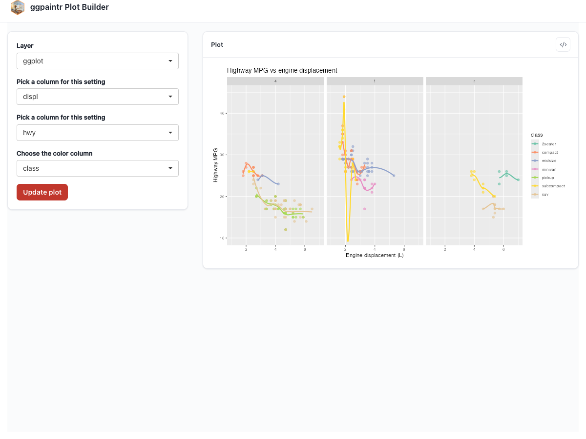
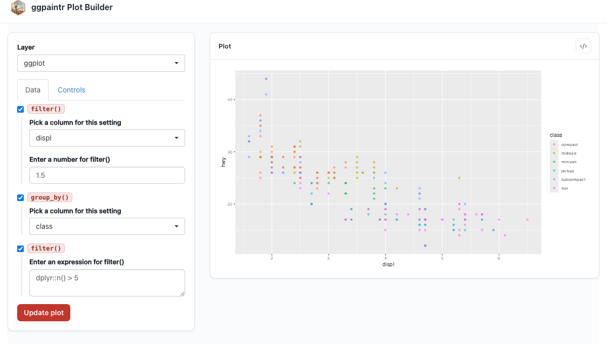
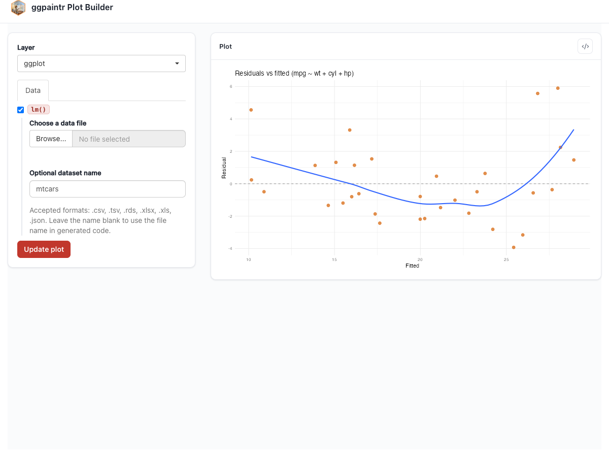
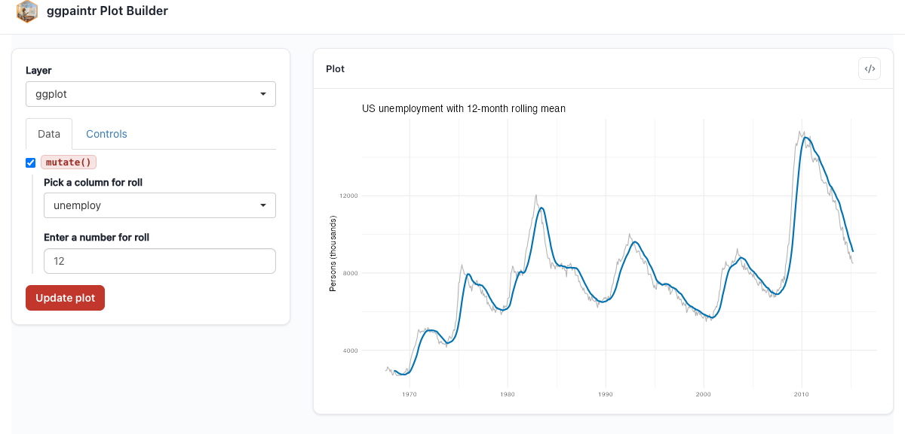
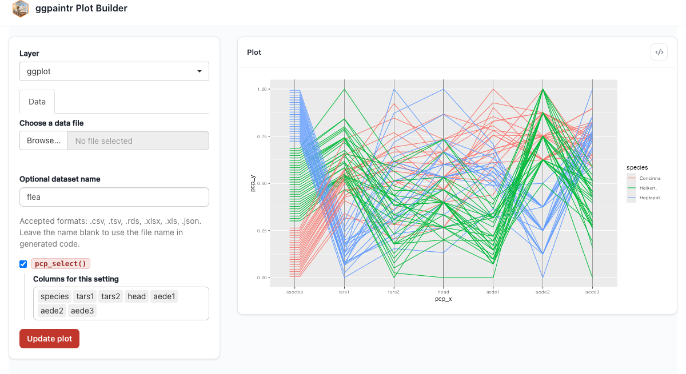

# Gallery {#sec-gallery}

This chapter is the recipe book. Every section pairs a **plain ggplot2 (or extension-package) graphic an analyst would actually write** — shown as real, evaluated output — with the **`ptr_app()` formula that exposes its knobs**, shown verbatim with a screenshot of the running app. The originals run as ordinary R at render time; the app versions are bound to tested fixtures like everywhere else in this book.

The custom placeholders used along the way (`ppRange`, `ppVars`, `ppPercent`) are defined inline so every example is self-contained; @sec-custom-placeholders explains the constructor machinery behind them.

```{r}
#| eval: false
# Packages used by this chapter's examples, beyond ggpaintr + ggplot2:
library(dplyr); library(tidyr); library(purrr); library(broom)
library(palmerpenguins); library(plotly); library(ggiraph)
library(ggpcp); library(GGally); library(ggridges); library(ggrepel)
library(ggalluvial); library(ggdist)
```

## A realistic ggplot2 graphic, parameterized {#sec-gallery-realistic}

A typical exploratory plot stacks several layers and reads several hard-coded constants. Here is a multi-layer fuel-economy chart from the `mpg` dataset:

```{r}
#| eval: true
#| warning: false
#| message: false
library(ggplot2)

ggplot(mpg, aes(displ, hwy, color = class)) +
  geom_point(alpha = 0.6, size = 2) +
  geom_smooth(method = "loess", se = FALSE, span = 0.75) +
  facet_wrap(~ drv) +
  scale_color_brewer(palette = "Set2") +
  labs(title = "Highway MPG vs engine displacement",
       x = "Engine displacement (L)", y = "Highway MPG") +
  coord_cartesian(xlim = c(1, 7), ylim = c(10, 45))
```

Now replace each tuning knob with a placeholder. The columns become pickers, the labels become text inputs, the y-range becomes a slider backed by a small custom value placeholder, `ppRange`, defined right in the chunk. Its length-2 default is validated by the package's own `ptr_arg_numeric(vector = TRUE, length = 2L)`, which constant-folds a literal like `c(10, 45)` without evaluating arbitrary code:

```{r}
#| eval: false
#| fixture: gallery-realistic
ppRange <- ptr_define_placeholder_value(
  keyword = "ppRange",
  build_ui = function(node, label = NULL, selected = NULL, ...) {
    v <- suppressWarnings(as.numeric(selected))
    initial <- if (length(v) == 2L && all(is.finite(v))) v else c(0, 50)
    shiny::sliderInput(node$id, label = label %||% "Range",
                       min = -100, max = 100, value = initial, step = 1)
  },
  resolve_expr = function(value, node, ...) {
    if (is.null(value) || length(value) != 2L) return(NULL)
    rlang::expr(c(!!value[1], !!value[2]))
  },
  ui_text_defaults = list(label = "Range for {param}"),
  parse_positional_arg = ptr_arg_numeric(vector = TRUE, length = 2L)
)

{
  ggplot(mpg, aes(ppVar(displ), ppVar(hwy), color = ppVar(class))) +
    geom_point(alpha = 0.6, size = 2) +
    geom_smooth(method = ppText("loess"), se = FALSE, span = 0.75) +
    ppLayerOff(facet_wrap(~ ppVar(drv)), FALSE) +
    scale_color_brewer(palette = "Set2") +
    labs(title = "Highway MPG vs engine displacement",
         x = ppText("Engine displacement (L)"), y = ppText("Highway MPG")) +
    coord_cartesian(xlim = ppExpr(c(1, 7)), ylim = ppRange(c(10, 45)))
} |>
  ptr_app()
```



Rebuilding the original graphic from the running app is a matter of picking those values; the code window lifts the selections back into a static script (@sec-generated-code).

## Data-cleaning pipelines into `ggplot()` {#sec-gallery-pipelines}

ggpaintr's formula grammar is a single `ggplot()` call plus `+` layers, and that covers the common "clean, then plot" pipeline: stages piped into `ggplot()` are lifted into the app when the lift gates pass — at least one stage, a lossless round-trip of the split, and a source that is a bare symbol (or a source-role placeholder like `ppUpload`). Pipeline stages with placeholders get the per-layer **Data** subtab described in @sec-formula-language.

### Filter, group, and plot

```{r}
#| eval: true
#| warning: false
#| message: false
library(dplyr)

mpg |>
  dplyr::filter(displ > 1.5) |>
  dplyr::group_by(class) |>
  dplyr::filter(dplyr::n() > 5) |>
  dplyr::ungroup() |>
  ggplot(aes(displ, hwy, color = class)) +
  geom_point(alpha = 0.5)
```

The same pipeline parameterized — thresholds, grouping column, and aesthetics become widgets:

```{r}
#| eval: false
#| fixture: gallery-pipeline
ptr_app(
  mpg |>
    dplyr::filter(ppVar(displ) > ppNum(1.5)) |>
    dplyr::group_by(ppVar(class)) |>
    dplyr::filter(ppExpr(dplyr::n() > 5)) |>
    dplyr::ungroup() |>
    ggplot(aes(ppVar(displ), ppVar(hwy), color = ppVar(class))) +
    geom_point(alpha = 0.5)
)
```



### PCA scores with 95% confidence ellipses

A classic exploratory move — project numeric columns onto their first two principal components, colour by a grouping factor, overlay confidence ellipses. The `do_pca()` helper keeps the lambda out of the pipe — a lambda stage would still run in the generated code, but it is silently inert in the UI: no stage row or toggle, and any placeholder inside it is ignored (@sec-formula-language):

```{r}
#| eval: true
#| warning: false
#| message: false
library(broom)

do_pca <- function(d, cols) {
  broom::augment(prcomp(d[, cols], scale. = TRUE), d)
}

iris |>
  do_pca(c("Sepal.Length", "Sepal.Width", "Petal.Length", "Petal.Width")) |>
  ggplot(aes(.fittedPC1, .fittedPC2, color = Species)) +
    stat_ellipse(level = 0.95, linewidth = 0.8) +
    geom_point(alpha = 0.8, size = 2) +
    scale_color_brewer(palette = "Dark2") +
    labs(title = "Iris in PC space, with 95% ellipses",
         x = "PC1", y = "PC2") +
    theme_minimal() +
    theme(legend.position = "bottom")
```

The app version adds a multi-column picker — a custom **consumer** placeholder, `ppVars`, that resolves its choices against the upstream data — plus an upload head and a toggleable `drop_na()` stage:

```{r}
#| eval: false
#| fixture: gallery-pca
ppVars <- ptr_define_placeholder_consumer(
  keyword = "ppVars",
  build_ui = function(node, cols, data, label = NULL, selected = NULL, ...) {
    retained <- intersect(selected %||% character(0), cols)
    shiny::selectInput(node$id, label = label %||% "Columns",
                       choices = cols, selected = retained,
                       multiple = TRUE)
  },
  resolve_expr = function(value, node, ...) {
    if (length(value) == 0L) return(NULL)
    rlang::call2("c", !!!as.list(value))
  },
  validate_session_input = function(value, ctx) {
    bad <- setdiff(value, ctx$upstream_cols)
    if (length(bad) == 0L) TRUE
    else paste0("Not in upstream data: ", paste(bad, collapse = ", "))
  },
  ui_text_defaults = list(label = "Columns for {param}"),
  parse_positional_arg = ptr_arg_string(vector = TRUE)
)

do_pca <- function(d, cols) {
  broom::augment(prcomp(d[, cols], scale. = TRUE), d)
}

{ppUpload(iris) |>
    ppVerbSwitch(drop_na(), FALSE) |>
    do_pca(ppVars(c("Sepal.Length", "Sepal.Width", "Petal.Length", "Petal.Width"))) |>
    ggplot(aes(ppVar(.fittedPC1), ppVar(.fittedPC2), color = ppVar(Species))) +
    stat_ellipse(level = 0.95, linewidth = 0.8) +
    geom_point(alpha = 0.8, size = 2) +
    scale_color_brewer(palette = "Dark2") +
    labs(title = "Iris in PC space, with 95% ellipses",
         x = "PC1", y = "PC2") +
    theme_minimal() +
    theme(legend.position = "bottom")} |>
  ptr_app()
```


### K-means elbow plot

Map `kmeans()` over a range of `k`, glance for `tot.withinss`, plot the elbow. This one stays static here: its natural parameterization (the cluster range driving both the data step and the x-axis breaks) uses a *shared* placeholder, covered in @sec-shared-placeholders.

```{r}
#| eval: true
#| warning: false
#| message: false
library(tidyr)
library(purrr)

tibble(k = 1:9) |>
  mutate(
    kmeans  = map(k, function(.k) kmeans(
      scale(iris[, c("Sepal.Length", "Sepal.Width",
                     "Petal.Length", "Petal.Width")]),
      centers = .k, nstart = 25)),
    glanced = map(kmeans, broom::glance)
  ) |>
  unnest(glanced) |>
  ggplot(aes(k, tot.withinss)) +
    geom_line(color = "gray50") +
    geom_point(size = 3, color = "#0072B2") +
    scale_x_continuous(breaks = 1:9) +
    labs(title = "Elbow plot for k-means on iris",
         x = "Number of clusters", y = "Total within-cluster SS") +
    theme_minimal()
```

### Regression diagnostics

`broom::augment()` turns an `lm` fit into a tidy frame whose `.fitted`, `.resid`, `.hat`, `.std.resid`, and `.cooksd` columns are the staples of regression diagnostics:

```{r}
#| eval: true
#| warning: false
#| message: false
broom::augment(lm(mpg ~ wt + cyl + hp, data = mtcars)) |>
  ggplot(aes(.fitted, .resid)) +
    geom_hline(yintercept = 0, color = "gray60", linetype = 2) +
    geom_point(alpha = 0.7, size = 2.5, color = "#D55E00") +
    geom_smooth(method = "loess", se = FALSE, span = 0.75) +
    labs(title = "Residuals vs fitted (mpg ~ wt + cyl + hp)",
         x = "Fitted", y = "Residual") +
    theme_minimal()
```

The app version swaps the data for an upload widget and the smoother for a text input:

```{r}
#| eval: false
#| fixture: gallery-regression
{broom::augment(lm(mpg ~ wt + cyl + hp, data = ppUpload(mtcars))) |>
    ggplot(aes(.fitted, .resid)) +
    geom_hline(yintercept = 0, color = "gray60", linetype = 2) +
    geom_point(alpha = 0.7, size = 2.5, color = "#D55E00") +
    geom_smooth(method = ppText("loess"), se = FALSE, span = 0.75) +
    labs(title = "Residuals vs fitted (mpg ~ wt + cyl + hp)",
         x = "Fitted", y = "Residual") +
    theme_minimal()} |>
  ptr_app()
```



Going one step further, the model formula itself becomes a `ppExpr` widget, so the user can swap responses and predictors at will:

```{r}
#| eval: false
#| fixture: gallery-regression-expr
{broom::augment(lm(ppExpr(Sepal.Length ~ Sepal.Width + Petal.Length), data = ppUpload(iris))) |>
    ggplot(aes(.fitted, .resid)) +
    geom_hline(yintercept = ppExpr(0), color = "gray60", linetype = 2) +
    geom_point(alpha = 0.7, size = 2.5, color = "#D55E00") +
    geom_smooth(method = ppText("loess"), se = FALSE, span = 0.75) +
    labs(title = "Residuals vs fitted (user-chosen model on iris)",
         x = "Fitted", y = "Residual") +
    theme_minimal()} |>
  ptr_app()
```


### Rolling time-series

`economics` (ships with ggplot2) holds 40+ years of monthly US macro indicators. The standard recipe — pick a series, overlay an *n*-month rolling mean:

```{r}
#| eval: true
#| warning: false
#| message: false
roll_mean <- function(x, n) {
  as.numeric(stats::filter(x, rep(1 / n, n), sides = 1))
}

economics |>
  mutate(roll = roll_mean(unemploy, 12)) |>
  ggplot(aes(date, unemploy)) +
    geom_line(color = "gray70") +
    geom_line(aes(y = roll), color = "#0072B2", linewidth = 1) +
    labs(title = "US unemployment with 12-month rolling mean",
         x = NULL, y = "Persons (thousands)") +
    theme_minimal()
```

Parameterized, the series and the window size become widgets:

```{r}
#| eval: false
#| fixture: gallery-rolling
roll_mean <- function(x, n) {
  as.numeric(stats::filter(x, rep(1 / n, n), sides = 1))
}

{economics |>
    mutate(roll = roll_mean(ppVar(unemploy), ppNum(12))) |>
    ggplot(aes(date, ppVar(unemploy))) +
    geom_line(color = "gray70") +
    geom_line(aes(y = roll), color = "#0072B2", linewidth = 1) +
    labs(title = "US unemployment with 12-month rolling mean",
         x = NULL, y = "Persons (thousands)") +
    theme_minimal()} |>
  ptr_app()
```



### Group-wise regression coefficients

Nest by a grouping factor, fit one `lm` per group, tidy the coefficients with confidence intervals, plot as a forest. Static here — its parameterization is a good exercise once you have read @sec-custom-placeholders:

```{r}
#| eval: true
#| warning: false
#| message: false
library(palmerpenguins)

penguins |>
  tidyr::drop_na(bill_depth_mm, bill_length_mm) |>
  group_by(species) |>
  tidyr::nest() |>
  mutate(
    fit  = map(data, function(.d) lm(bill_depth_mm ~ bill_length_mm, data = .d)),
    tidy = map(fit,  function(.f) broom::tidy(.f, conf.int = TRUE))
  ) |>
  unnest(tidy) |>
  filter(term == "bill_length_mm") |>
  ggplot(aes(estimate, species, color = species)) +
    geom_vline(xintercept = 0, color = "gray60", linetype = 2) +
    geom_pointrange(aes(xmin = conf.low, xmax = conf.high), size = 0.8) +
    scale_color_brewer(palette = "Dark2") +
    labs(title = "Slope of bill depth ~ bill length, by species",
         x = "Estimate (95% CI)", y = NULL) +
    theme_minimal() +
    theme(legend.position = "none")
```

## Interactive output packages {#sec-gallery-interactive}

ggpaintr's default renderer is a static plot pane, but the plot object it builds is an ordinary ggplot — anything that consumes a ggplot can render it. The two examples below show the *original* interactive graphics; wiring a ggpaintr app to drive them requires owning the renderer, which is exactly the L3 pattern in @sec-custom-render — that chapter's worked examples are these two plots.

### plotly tooltips

```{r}
#| eval: true
#| warning: false
#| message: false
library(plotly)

p <- ggplot(mpg, aes(displ, hwy, color = class,
                     text = paste(manufacturer, model, sep = " "))) +
       geom_point(size = 3, alpha = 0.7) +
       coord_cartesian(xlim = c(1, 7), ylim = c(10, 45))

plotly::ggplotly(p, tooltip = "text")
```

### ggiraph tooltips

```{r}
#| eval: true
#| warning: false
#| message: false
library(ggiraph)

gg <- ggplot(mpg, aes(displ, hwy)) +
  geom_point_interactive(aes(tooltip = model), size = 3, color = "#e63946")
girafe(ggobj = gg)
```

## ggplot2 extension packages {#sec-gallery-extensions}

ggpaintr does not know about extension geoms — it sees them as ordinary layer calls and parameterizes their arguments the same way it parameterizes core geoms.

### ggpcp — parallel coordinates

```{r}
#| eval: true
#| warning: false
#| message: false
library(ggpcp)
data(flea, package = "GGally")

flea |>
  pcp_select(species, tars1, tars2, head, aede1, aede2, aede3) |>
  pcp_scale(method = "uniminmax") |>
  pcp_arrange() |>
  ggplot(aes_pcp()) +
    geom_pcp_axes() +
    geom_pcp(aes(colour = species))
```

The app version lets the user pick which columns go on the parallel axes, reusing the `ppVars` consumer from the PCA example:

```{r}
#| eval: false
#| fixture: gallery-pcp
ppVars <- ptr_define_placeholder_consumer(
  keyword = "ppVars",
  build_ui = function(node, cols, data, label = NULL, selected = NULL, ...) {
    retained <- intersect(selected %||% character(0), cols)
    shiny::selectInput(node$id, label = label %||% "Columns",
                       choices = cols, selected = retained,
                       multiple = TRUE)
  },
  resolve_expr = function(value, node, ...) {
    if (length(value) == 0L) return(NULL)
    rlang::call2("c", !!!as.list(value))
  },
  validate_session_input = function(value, ctx) {
    bad <- setdiff(value, ctx$upstream_cols)
    if (length(bad) == 0L) TRUE
    else paste0("Not in upstream data: ", paste(bad, collapse = ", "))
  },
  ui_text_defaults = list(label = "Columns for {param}"),
  parse_positional_arg = ptr_arg_string(vector = TRUE)
)

{ppUpload(flea) |>
    pcp_select(ppVars(c("species", "tars1", "tars2", "head", "aede1", "aede2", "aede3"))) |>
    pcp_scale(method = "uniminmax") |>
    pcp_arrange() |>
    ggplot(aes_pcp()) +
    geom_pcp_axes() +
    geom_pcp(aes(colour = ppVar(species)))} |>
  ptr_app()
```



### ggridges — ridge densities

```{r}
#| eval: true
#| warning: false
#| message: false
library(ggridges)

ggplot(lincoln_weather,
       aes(x = `Mean Temperature [F]`, y = Month, fill = after_stat(x))) +
  geom_density_ridges_gradient(scale = 3, rel_min_height = 0.01,
                               bandwidth = 3) +
  scale_fill_viridis_c(option = "C")
```

`lincoln_weather` ships with non-syntactic column names (`Mean Temperature [F]`, …), so a parameterized version needs `ptr_normalize_column_names()` first — the recipe is in @sec-getting-started.

### ggrepel — labelled scatter

```{r}
#| eval: true
#| warning: false
#| message: false
library(ggrepel)

mt <- data.frame(mtcars, model = rownames(mtcars))

ggplot(mt, aes(wt, mpg, label = model)) +
  geom_point(size = 3, color = "steelblue") +
  geom_text_repel(size = 3.5, max.overlaps = 12, box.padding = 0.3)
```

### ggalluvial — flow diagrams

```{r}
#| eval: true
#| warning: false
#| message: false
library(ggalluvial)

ggplot(vaccinations,
       aes(x = survey, stratum = response, alluvium = subject,
           y = freq, fill = response)) +
  geom_flow(alpha = 0.7) +
  geom_stratum() +
  scale_x_discrete(expand = c(0.1, 0.1))
```

### ggdist — distribution visualizations

```{r}
#| eval: true
#| warning: false
#| message: false
library(ggdist)

ggplot(mtcars, aes(x = factor(cyl), y = mpg)) +
  stat_halfeye(adjust = 0.5, justification = -0.2,
               .width = 0, point_colour = NA, slab_alpha = 0.6) +
  geom_boxplot(width = 0.15, outlier.shape = NA) +
  coord_flip()
```

For the parameterized flavour of this family, here is a complete custom **value** placeholder: `ppPercent` renders a 0–100 slider and folds back the value divided by 100 — a friendlier alpha control than a raw decimal:

```{r}
#| eval: false
#| fixture: gallery-percent
ppPercent <- ptr_define_placeholder_value(
  keyword = "ppPercent",

  build_ui = function(node, label = NULL, selected = NULL,
                      named_args = list(), ...) {
    step <- named_args$step %||% 1
    shiny::sliderInput(
      node$id, label = label %||% "Percent",
      min = 0, max = 100,
      value = selected,
      step = step
    )
  },

  resolve_expr = function(value, node, ...) {
    if (is.null(value)) return(NULL)
    as.numeric(value) / 100
  },

  validate_session_input = function(value, ctx) {
    v <- suppressWarnings(as.numeric(value))
    if (length(v) != 1L || is.na(v) || v < 0 || v > 100) {
      rlang::abort("Percent must be a single number between 0 and 100.")
    }
    TRUE
  },

  parse_positional_arg = ptr_arg_numeric(),
  parse_named_args = list(step = ptr_arg_numeric()),
  embellish_eval   = function(x, ...) as.numeric(x) / 100,
  ui_text_defaults = list(label = "Percent for {param}")
)

ptr_app(
  ggplot(mtcars, aes(x = ppVar("wt"), y = ppVar("mpg"))) +
    geom_point(alpha = ppPercent(40, step = 5))
)
```


## Where to go next {#sec-gallery-next}

- The three-level ladder (all-in-one app → embed → own the layout): @sec-intro, @sec-embed-default, @sec-embed-bare.
- The shared-placeholder pattern (one widget driving several plots, or several spots in one formula): @sec-shared-placeholders.
- The custom-placeholder constructors used throughout this gallery, with the full hook contract: @sec-custom-placeholders.
- Driving plotly / ggiraph from a ggpaintr app — the interactive versions of § "Interactive output packages": @sec-custom-render.
- The safety model behind `ppExpr` and `ppUpload`: @sec-safety.
