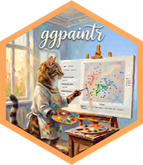

# Welcome {.unnumbered}

{.welcome-logo width="180" fig-alt="ggpaintr logo"}

This is the book for **ggpaintr**, an R package that turns ggplot-like *formulas* into Shiny apps: placeholder keywords in the formula (`ppVar`, `ppText`, `ppNum`, `ppExpr`, `ppUpload`) become input widgets automatically.

The book teaches **how to use ggpaintr** and **how to extend it**. New to the package? Start with @sec-intro — it shows the plot-to-app round trip in one page and maps the rest of the book.

## Who this is for

Readers who know ggplot2 and want to build, embed, customize, or extend ggpaintr-driven plotting apps. **No Shiny knowledge is assumed**: the first half of the book never touches it, and the part that embeds ggpaintr inside your own Shiny app (@sec-embed-default) says so when that changes.

## Installing

```r
remotes::install_github("willju-wangqian/ggpaintr")
```

## How the examples work {#sec-examples}

ggpaintr produces **interactive Shiny apps**. Unlike a ggplot2 plot, a running app cannot be embedded as static HTML in a book — so every example shows the code verbatim alongside a screenshot of the resulting app. Output that *is* static (the generated ggplot2 code string, the formula→widget mapping) is shown as real evaluated output.
