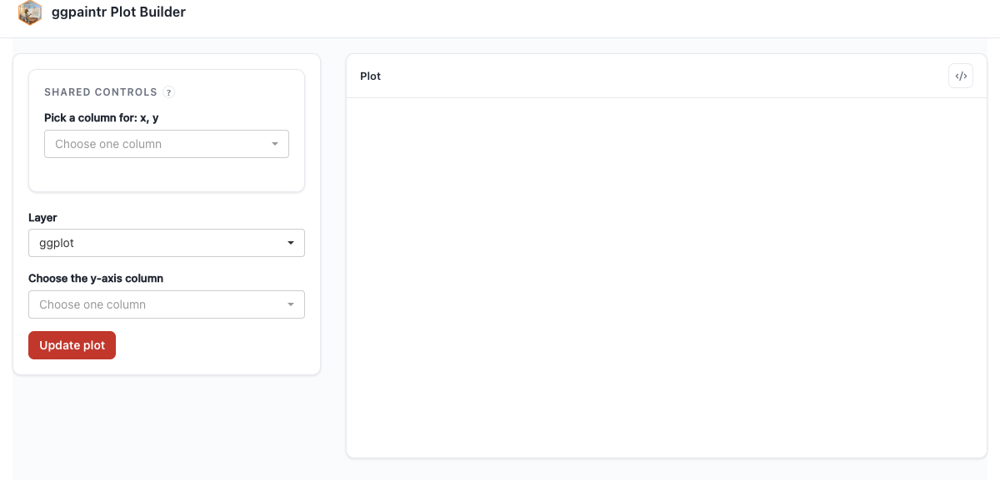

# Shared Placeholders {#sec-shared-placeholders}

A placeholder annotated `keyword(shared = "<key>")` is driven by **one** widget in lockstep wherever that key appears — across `aes()`, pipeline stages, and (in the multi-plot case) across formulas. *Where* that widget surfaces is decided per key by how many formulas reference it — the **partition rule**:

> A shared key referenced in **exactly one** formula → that formula's inline **shared section**, rendered inside its own control panel.
> A shared key referenced in **two or more** formulas → the one standalone **shared panel**.

Example: `f1 = sharedA + sharedA + sharedB`, `f2 = sharedC + sharedC + sharedB` ⟹ f1's inline section holds `sharedA`, f2's holds `sharedC`, the standalone panel holds `sharedB`.

The practical consequence is a hard split by **instance count**.

## One instance: no coordinator, ever

With a single ggpaintr instance every shared key is formula-local by definition, so it auto-renders in that instance's inline shared section. The single-instance realization is plain L1 `ptr_app()` — write the annotation and you are done:

```{r}
#| eval: false
#| fixture: shared-inline
ptr_app(
  "ggplot(iris, aes(x = ppVar(shared = 'col'), y = ppVar - ppVar(shared = 'col'),
                    color = Species)) + geom_point()"
)
```



Bare `ptr_server()` on a `shared = "..."` formula behaves the same way: it self-binds every declared key under its own namespace and renders the widgets inline, exactly like `ptr_app()` does.

## Multiple instances: the shared trio

When you embed two or more ggpaintr blocks (@sec-multi-plot) and want one widget to drive several of them, build the coordinator once and feed it to the three consumers. The contract:

- `ptr_shared(formulas, ...)` → `obj`. Pass the **same list of formula strings** you will hand to the modules. Widgets for shared keys are auto-built from each key's placeholder kind — a `ppVar(shared = "...")` gets a column picker, a `ppNum` a numeric input, and a registered custom placeholder its own `build_ui`. `obj` carries the computed partition (`obj$panel_keys`, plus the per-formula local keys) and is pure and non-reactive, so the UI and server can never disagree about which key lives where.
- `ptr_shared_panel(obj, css = NULL)` — the **one** standalone panel, holding exactly `obj`'s cross-formula keys. Self-contained; place it once, wherever you want on the page.
- `ptr_shared_server(obj)` — call **once at the top level** of your server (never inside `moduleServer()`). Returns the shared-state bundle.
- `ptr_server(formula, id, shared_state = <bundle>)` — pass the bundle to every per-plot module. Each module renders its own formula-local keys inline and reads the panel keys from the bundle.

```{r}
#| eval: false
#| fixture: shared-trio
plots <- list(
  "ggplot(iris, aes(x = ppVar(shared = 'metric'), y = Sepal.Length, fill = Species)) + geom_boxplot()",
  "ggplot(iris, aes(x = ppVar(shared = 'metric'), y = Sepal.Width,  fill = Species)) + geom_violin()"
)

obj <- ptr_shared(formulas = plots)

ui <- shiny::fluidPage(
  shiny::titlePanel("My host app"),
  ptr_shared_panel(obj),
  shiny::fluidRow(
    shiny::column(6, ptr_ui(plots[[1]], "plot_1", shared = obj)),
    shiny::column(6, ptr_ui(plots[[2]], "plot_2", shared = obj))
  )
)
server <- function(input, output, session) {
  sh <- ptr_shared_server(obj)
  ptr_server(plots[[1]], "plot_1", shared_state = sh)
  ptr_server(plots[[2]], "plot_2", shared_state = sh)
}

shiny::shinyApp(ui, server)
```


`ptr_shared_panel()` emits a **Draw all** button (top-level input id `ptr_shared_draw_all`) whenever the coordinator spans two or more formulas and the `gate_draw` setting is on (the default; `ptr_options(gate_draw = FALSE)` drops the button and each panel re-renders live instead); the per-module **Update plot** buttons still work independently. Building `ptr_shared()` from a `formulas` list that declares no `shared = "..."` annotation is an error — drop the coordinator and use the plain module path if nothing is shared.

## The partition in action

Mix a cross-formula key with formula-local ones and the rule sorts every widget into the right place:

```{r}
#| eval: false
#| fixture: shared-partition
plots <- list(
  "ggplot(iris, aes(x = ppVar(shared = 'ax1'), y = ppVar - ppVar(shared = 'ax1'),
                    color = Species)) + geom_point(size = ppNum(shared = 'sz'))",
  "ggplot(iris, aes(x = ppVar(shared = 'ax2'), y = Sepal.Width,
                    color = Species)) + geom_point(size = ppNum(shared = 'sz'))"
)

obj <- ptr_shared(formulas = plots)
# sz → both formulas → standalone panel.  ax1 → only plot_1's inline section.
# ax2 → only plot_2's inline section.

ui <- shiny::fluidPage(
  ptr_shared_panel(obj),             # holds sz only
  shiny::fluidRow(
    shiny::column(6, ptr_ui(plots[[1]], "plot_1", shared = obj)),  # ax1 inline
    shiny::column(6, ptr_ui(plots[[2]], "plot_2", shared = obj))   # ax2 inline
  )
)
server <- function(input, output, session) {
  sh <- ptr_shared_server(obj)
  ptr_server(plots[[1]], "plot_1", shared_state = sh)
  ptr_server(plots[[2]], "plot_2", shared_state = sh)
}

shiny::shinyApp(ui, server)
```


## How input ids are built — and how to avoid colliding with them

The framework names every widget it emits from the formula's syntax, so the same formula always produces the same ids. When you mix ggpaintr UI with your own widgets in the same Shiny namespace, the cleanest fix is to wrap the embed in `ptr_ui()` / `ptr_server()` with a unique `id` — everything ggpaintr emits then lives under `<id>-…` and your top-level inputs cannot collide. If you can't namespace, the surface to avoid:

**Layer names.** Each top-level call in the formula contributes a layer name equal to the function being called (`ggplot`, `geom_point`, `facet_wrap`, …). Repeats get `-2`, `-3`, … suffixes: `geom_point() + geom_point()` yields `geom_point`, `geom_point-2`.

**Per-placeholder input ids** follow `<layer>_<path>_<keyword>_NA`, where `<path>` is the underscore-joined positional index path into the call. `aes(x = ppVar, y = ppVar)` inside the `ggplot()` layer yields `ggplot_1_1_ppVar_NA` and `ggplot_1_2_ppVar_NA`. A shared annotation never gets a layer-derived id: `ppVar(shared = "x_col")` is bound at the canonical `shared_x_col`. Every shared key owns `shared_<key>` (and, when the key sits on a piped stage, `shared_<key>_stage_enabled`), so treat those as part of the collision surface too.

**Layer-derived ids:**

| Pattern                                       | What it is |
|-----------------------------------------------|------------|
| `<layer>_checkbox`                            | "include this layer" toggle (no checkbox on `ggplot`) |
| `<layer>_<path>_stage_enabled`                | per-stage toggle on piped data-arg pipelines |
| `<placeholder-id>_ui`                         | `renderUI` container for any placeholder (value, source, or consumer) |
| `<layer>_subtab`, `ptr_layer_content_<layer>` | internal layer-nav and panel-container ids |

**Top-level package-owned ids.** The framework writes to a fixed set of `ptr_`-prefixed top-level ids that are **not** user-configurable: `ptr_plot`, `ptr_error`, `ptr_code`, `ptr_code_mode`, `ptr_update_plot`, the panel ids `ptr_shared_draw_all` / `ptr_shared_errors`, and the layer-nav inputs `ptr_layer_select` / `ptr_layer_tabset`. Treat the whole `ptr_` prefix as reserved. When `ptr_shared(id = "<id>")` is supplied, every coordinator-owned id is carried under an `<id>-` prefix, so two coordinators can coexist in one session.

> Rule of thumb: in a host app's top-level namespace, don't author Shiny inputs or outputs whose ids start with `ptr_` or `shared_`, or match `<layer-name-from-your-formula>_…`. If that feels brittle, wrap the embed with a unique `id` and the collision surface disappears entirely.
