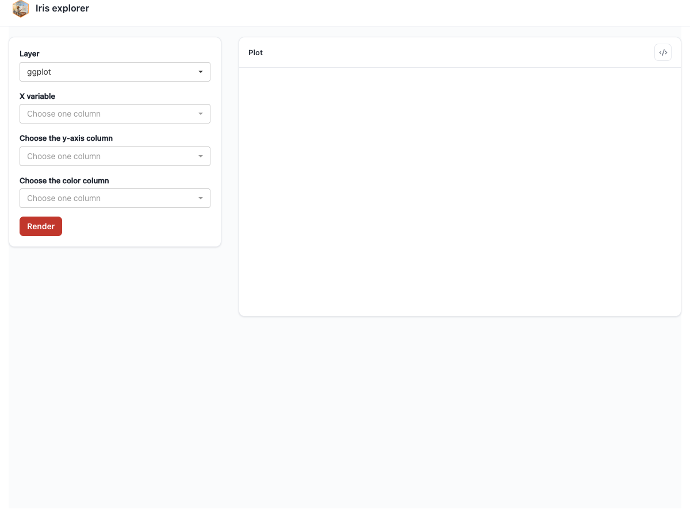

# UI Text and Copy {#sec-ui-text}

Every label, placeholder, and help string in the generated UI comes from a deep-merged copy-rules tree. ggpaintr ships defaults; you override any subset by passing `ui_text =` to any entry point (`ptr_app()`, `ptr_ui()` / `ptr_server()`, `ptr_shared()`). Only the keys you spell out change — everything else stays at its built-in value.

## The six override sections

| Section          | What it controls |
|------------------|------------------|
| `shell`          | Outer chrome — app title, draw / draw-all buttons, layer picker label, data / controls subtab labels. |
| `upload`         | The `ppUpload` widget — nested `file` and `name` entries carrying the file-picker label and the optional dataset-name label / placeholder / help text. |
| `layer_checkbox` | The "include this layer" toggle on each layer panel. |
| `defaults`       | Per-keyword copy defaults — one entry per registered placeholder, including custom ones (auto-populated from each registration's `ui_text_defaults`). |
| `params`         | Per-parameter overrides — copy that applies when a placeholder appears as the `x`, `color`, `title`, `alpha`, … argument of a layer. |
| `layers`         | Per-layer overrides — copy scoped to one placeholder occurrence inside one specific layer call (e.g. the positional `ppExpr` of `facet_wrap()`). |

The first three sections have fixed lookup paths: `layer_checkbox` is a single leaf, `upload` nests one level (`file`, `name`), and `shell` holds one leaf entry per chrome slot plus four plain-string keys for shared-controls copy (`shared_section_title` / `shared_section_hint`, `shared_panel_title` / `shared_panel_hint`). The last three are nested by keyword — and, for `layers`, by layer name × keyword × parameter — letting you scope an override to a single placeholder, a single parameter, or a single layer.

## Merge precedence

When the runtime needs the copy for a *control* (the widget for one placeholder occurrence in one layer), it deep-merges three rules in order:

1. `defaults[[keyword]]` — most general.
2. `params[[param_key]][[keyword]]` — keyed by the surrounding parameter name.
3. `layers[[layer_name]][[keyword]][[param_key]]` — keyed by the layer the placeholder lives in.

Each later rule wins on fields it specifies; fields it omits fall back to the earlier rule. For the other UI slots (chrome, upload widget, layer checkbox) the resolution path is fixed — the override either replaces a leaf field or does not.

## Building overrides

```{r}
#| eval: false
#| fixture: ui-text-overrides
custom_text <- ptr_ui_text(list(
  shell = list(
    title       = list(label = "Iris explorer"),
    draw_button = list(label = "Render")
  ),
  params = list(
    x     = list(ppVar  = list(label = "X variable")),
    title = list(ppText = list(label = "Plot heading"))
  )
))

ptr_app(
  "ggplot(iris, aes(x = ppVar, y = ppVar, color = ppVar)) +
     geom_point() +
     labs(title = ppText)",
  ui_text = custom_text
)
```



`ptr_ui_text()` validates the partial override and returns a fully-merged object. Passing the bare list works too — the entry points call it internally — but wrapping explicitly catches typos in section keys at construction time rather than at render time.

## The low-level lookup

`ptr_resolve_ui_text(component, keyword, param, layer_name, ui_text)` is the lookup the runtime uses to fetch the resolved copy for a single UI slot. Embedders writing custom UIs that mix ggpaintr-driven labels with their own copy can call it directly — the wrapper in @sec-theming-wrappers uses it to resolve its page title — but most users never need it.

## Where custom placeholders fit

A custom placeholder's registration-time `ui_text_defaults` (@sec-hook-contract) populates its entry in the `defaults` section, so app authors can re-copy *your* widget through the same `ui_text =` machinery without touching your code — the `{param}` interpolation included.
