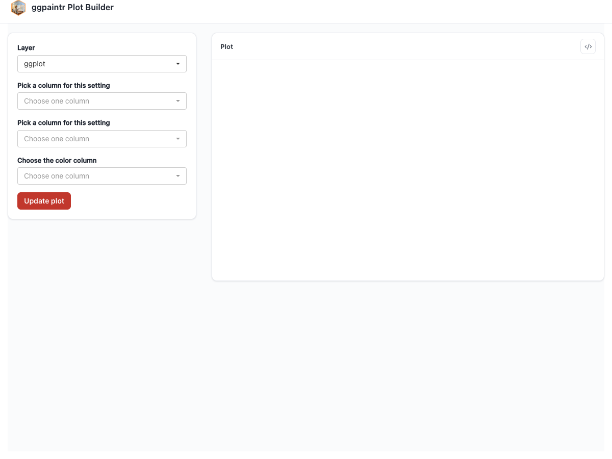

# Use Cases: the Three Levels {#sec-use-cases}

ggpaintr exposes three levels of control, and choosing the right one up front saves rework. This chapter covers **L1**, the all-in-one entry point, and maps where the other two live:

| Level | Entry points | Use when | Chapter |
|-------|--------------|----------|---------|
| L1 | `ptr_app()` | The built-in chrome — title bar, layer picker, plot pane, code window — is enough. | this one |
| L2 | `ptr_ui()` / `ptr_server()` | You own the surrounding Shiny app and want ggpaintr plots inside it. | @sec-embed-default |
| L3 | bare UI pieces (`ptr_ui_page`, `ptr_ui_controls`, …) | You own the page layout, the renderer, or both. | @sec-embed-bare, @sec-custom-render |

L1 is the dominant use case: hand ggpaintr a formula, get back a running Shiny app.

## Single plot — `ptr_app()`

The string form of the formula works exactly like the bare-code form you saw in @sec-getting-started:

```{r}
#| eval: false
#| fixture: use-cases-app-basic
ptr_app(
"ggplot(iris, aes(ppVar, ppVar, color = ppVar)) + geom_point() + labs(title = ppText)"
)
```



## The chrome you get for free

Every L1 app ships the same furniture, all driven by the formula with no configuration:

```{r}
#| eval: false
#| fixture: use-cases-layers
ptr_app(
"ggplot(mpg, aes(displ, hwy)) +
geom_point(alpha = ppNum(0.5)) +
geom_smooth(method = ppText('loess'))"
)
```


- **The layer picker.** One entry per layer in the formula; selecting a layer shows that layer's widgets. Layers carrying no placeholder still appear, so the user sees the whole chart's structure.
- **The Data subtab.** When a layer's data argument is a pipeline (@sec-formula-language), its stages get widgets and per-stage toggles here.
- **The code window.** The `</>` toggle opens the generated code — Final code and Spec views, with a Copy button (@sec-generated-code).
- **The Update plot button.** Nothing redraws until it is clicked (@sec-placeholders).

## Several plots in one app

`ptr_app()` builds exactly one plot per app. To place several ggpaintr plots in one Shiny app — optionally sharing a control across them — you drop down one level to `ptr_ui()` / `ptr_server()` and own the `shinyApp()` shell yourself. That is a small step, not a leap: @sec-multi-plot walks through it, and @sec-shared-placeholders covers the shared-widget machinery.

## A different shell or theme

The built-in chrome is deliberately plain. For your own page shell, branding, or theme, write a thin wrapper over the public primitives — the recipe and a worked example are in @sec-theming-wrappers, and the stable CSS surface is documented in @sec-customization.

## Local data with non-syntactic columns

`ppVar` placeholders need syntactic, unique column names — `Sepal.Length` is fine, `"Sepal Length"` is not, and `iris` deliberately ships clean. If your local data has spaces, reserved words, or duplicates in its names, pipe it through `ptr_normalize_column_names()` before referencing it from a formula:

```{r}
#| eval: false
#| fixture: use-cases-nonsyntactic
messy <- data.frame(
  check.names = FALSE,
  "first column" = 1:3,
  "if"           = 4:6
)
clean <- ptr_normalize_column_names(messy)

ptr_app("ggplot(clean, aes(x = ppVar('first_column'), y = ppVar('if_'))) + geom_point()")
```


Uploaded data is normalized automatically; the manual call is only for data already in your session. The exact rules are in @sec-generated-code and `?ptr_normalize_column_names`.
